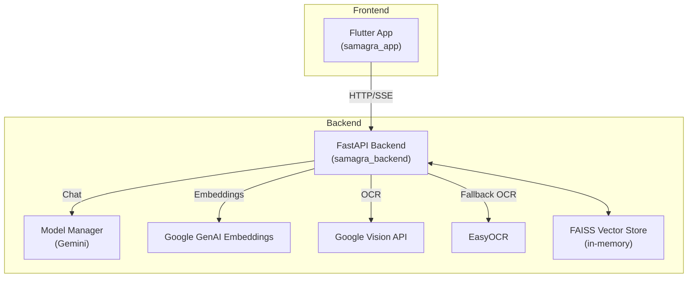

# Architecture 🧭

This document describes the overall system design for SamagraAI, including services, data flows, and key components.

## High‑level Diagram

> Next: See [Backend](Backend.md) for services and pipelines.

## Component Responsibilities
- Flutter App
  - Chat UI, streaming markdown rendering
  - Document and image attachment UI with previews
  - Speech input controls (plugin vs web fallback)
  - Providers: `ChatProvider`, `ThemeProvider`

- FastAPI Backend
  - `api/chat.py`: `/chat` (sync) and `/chat/stream` (SSE). Optional model selection and document/image metadata.
  - `api/document.py`: `/documents/upload` and `/documents/upload-document` for PDF ingestion.
  - `services/chat_service.py`: orchestrates chat flow, streaming, RAG usage, and image generation mode.
  - `services/rag_service.py`: FAISS index lifecycle; PDF splitting; OCR ingestion via Vision/EasyOCR; retriever access.
  - `services/model_manager.py`: Gemini model configuration (chat + image gen), system instruction, and switching.

> Prev: Back to [Docs Hub](README.md) · Next: [Backend](Backend.md)

## Data Stores
- FAISS vector store is held in memory per backend process (non-persistent). It accumulates multiple documents and OCR’d text until cleared.

## Security & Keys
- Google API key loaded via `.env` and `core/config.py`. Used for Gemini (chat, embeddings) and optionally Vision OCR.

## Streaming
 - Server-Sent Events (SSE): `/chat/stream` sends JSON `data:` lines with either text chunks or special image payloads, plus a final `{done: true}` marker.

---
Prev: [Docs Hub](README.md) · Next: [Backend](Backend.md)
