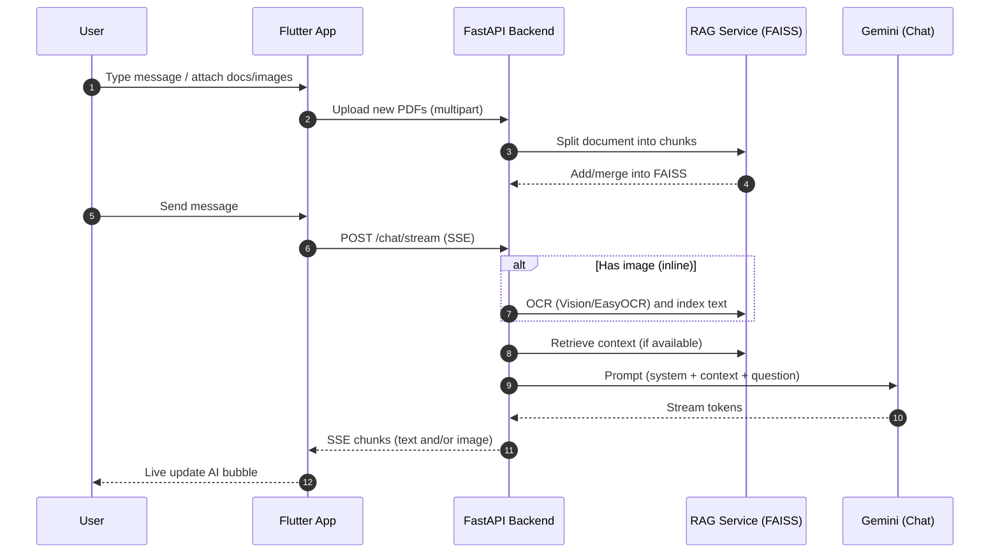

# Workflow & App Flow 🔄

> Prev: [API](API.md) · Next: [Setup](Setup.md)

## End-to-End Message Flow

## Context Handling
- The backend keeps an in-memory FAISS index across uploads until cleared.
- For each turn, if a retriever exists, a RAG chain grounds answers on top‑k chunks.
- Images are treated as additional text context after OCR.

## Attachments UX
- Documents/images selected for the next message appear as a preview above the input bar (staged list).
- On send, documents upload first; the chat request references them and the stream begins.

## Error Paths

---
- OCR or PDF parsing failure → proceed without extra context; user is informed in the stream.
- SSE parse errors on client → gracefully stop and show partial answer.

Prev: [API](API.md) · Next: [Setup](Setup.md)